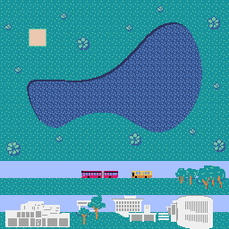
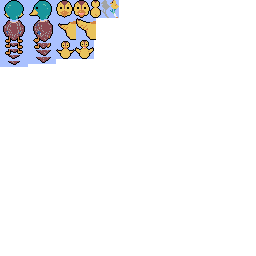

# Seek the Child at Kamoike

「もうお家に帰る時間よー！」

鴨池に散らばった子がもたちを 家に連れて帰ろう！

Seek the Child at Kamoike！


このゲームは、Python 向けのレトロゲームエンジン「[Pyxel](https://github.com/kitao/pyxel)」を使って作成されたアクションゲームです。

鴨池の周りにいる子がも達を集めて、家に帰しましょう！

[Click to Play](https://sugijotaro.github.io/seek-the-child-at-kamoike)

## 画面説明


- 左上が経過時間
- 右上の上側に子がもインジケーターがあります。家に帰すことができた子がもの数が表示されます。
- 右上の下側にはねぎインジケーターがあります。プレイ中に 3 回だけ、このネギを食べることによってダッシュすることができます。

## 操作方法

- WASD で上下左右に移動
- スペースキーでネギを食べて加速できる

## ゲームの目標

子がもを 5 匹すべて家に帰すとゲームクリアです！

ゲームをクリアすると、クリアまでにかかった時間が表示されます。

これまでのスコアも確認することができます！

なるべく早く子供を家に帰すことができるように頑張りましょう！

## ゲームの実行方法

まず Pyxel をインストールしてください。（[インストール方法](https://github.com/kitao/pyxel/blob/main/docs/README.ja.md#%E3%82%A4%E3%83%B3%E3%82%B9%E3%83%88%E3%83%BC%E3%83%AB%E6%96%B9%E6%B3%95)）

リポジトリをクローンし、ルートディレクトリにある`start_game.command`を実行してください。

```
git clone https://github.com/sugijotaro/seek-the-child-at-kamoike.git
cd seek-the-child-at-kamoike
sh ./start_game.command
```

注意：このスクリプトは Unix 系のシステム（Linux や macOS）で動作します。Windows の場合は適当なバッチファイルを作成するか、手動で`pyxel run src/main`を実行してください。

web 上で実行することもできますが、動作が重いので、ローカルでの実行を推奨します。([web 版](https://sugijotaro.github.io/seek-the-child-at-kamoike))

## 工夫した点

### 1. 3D 表現

レトロゲームエンジンで 3D ゲームを作成するにあたり、擬似的に 3D を表現する部分を工夫しました。

1. **3 人称視点のカメラの計算**

プレイヤーの位置と視野角から、現在のカメラの位置を計算します。プレイヤーの位置から一定距離離れた点をカメラの座標として定義し、計算しています。

2. **ピクセルの描画**

カメラの位置と視野角から、現在のカメラが捉えている範囲内の各ピクセルの色を決定します。視野内のピクセル位置をベクトル演算によって計算し、線形補間を用いてピクセルの色を決定しています。

3. **3D ビューの描画**

視野角から、視野内の景色（地形やオブジェクト）を 3D 表示します。カメラの視野内の各点を画面に投影することで、3D 効果を出しています。

4. **遠近感の演出**

画面上に表示するピクセルの色を、ピクセルが表現する空間上の点がプレイヤーからどれだけ離れているかによって変化させることで、遠近感を演出します。遠くの物体は小さく、近くの物体は大きく描かれます。

### 2. ゲームバランス

ゲームとして面白くするために、リスクとリターンの関係性を意識しました。

親がもの速度は、牽引する子がもの数が多ければ多いほど遅くなってしまいます。

逆に、一度に 2、3 匹だけを家に帰すと、往復で無駄に時間がかかってしまいます。

また、鴨池を泳いでショートカットすることもできますが、鴨池の中にいるときは曲がりづらくなってしまうため操作性が下がってしまいます。

このような駆け引きを作成し、より面白くなるように心がけました。

また、ゲーム中に 3 回だけ使用可能な加速も、その使いどころがタイム短縮の重要なポイントとなるように工夫しました。

### 3. SFC や鴨池の見た目

 

世界観を統一するため、親がもや子がも、マップ、背景などの見た目をすべて 1 から作成しました。


また、親がもがダッシュするときは画面上に集中線のエフェクトを出したり、各行動を起こすたびに効果音を鳴らすなど、ユーザーの行動と合わせた変化をゲームで演出することで、操作感の向上を図りました。

### 4. これまでのスコアの表示


ゲームをクリアするたびにスコアを保存し、あとから見返すことができるようにしました。

---

[Click to Play](https://sugijotaro.github.io/seek-the-child-at-kamoike)

ゲームエンジン：[Pyxel](https://github.com/kitao/pyxel)

ゲーム内の音楽は以下のツールを使用して作成しました：[8bit BGM Generator](https://github.com/shiromofufactory/8bit-bgm-generator)
